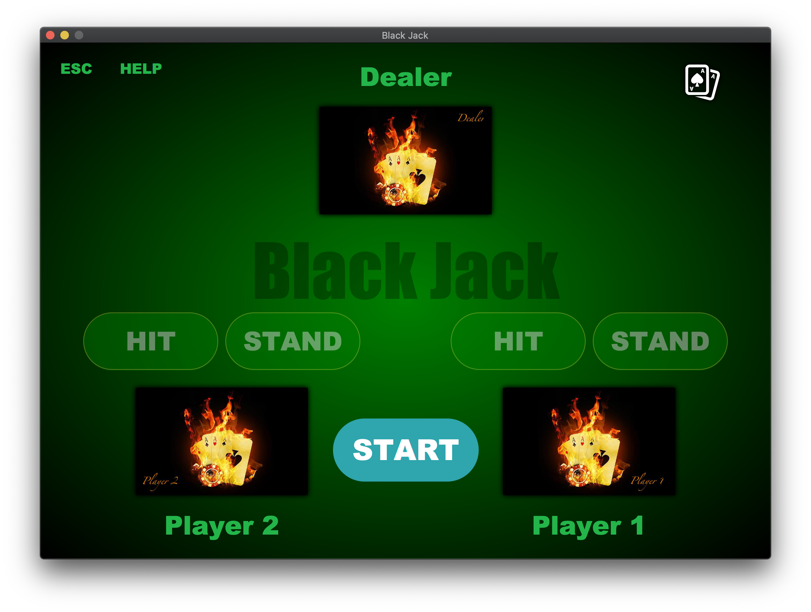
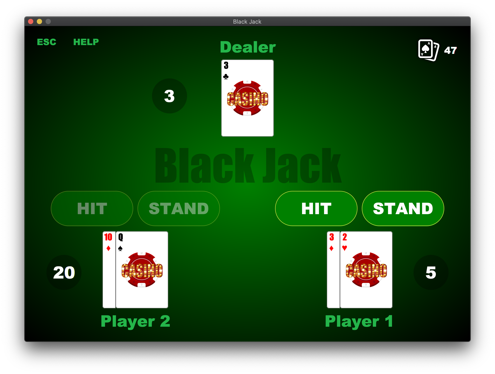
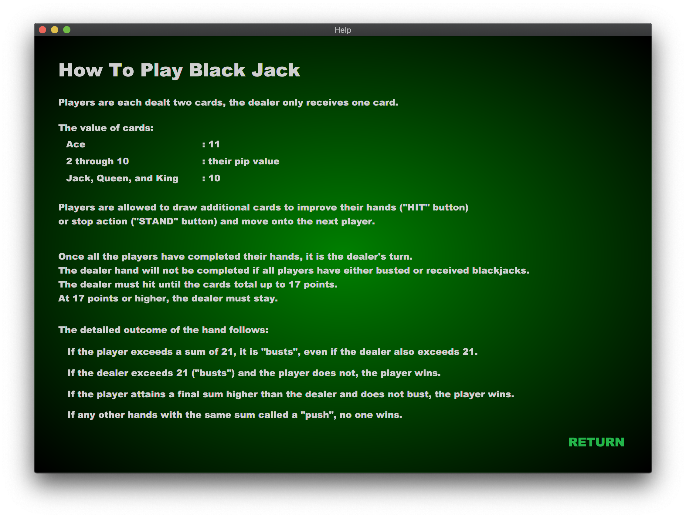

# Java-BlackJack
[Original Repo](https://github.com/YumiMachino/Group1_BlackJack)

## What's BlackJack App
An application that two users play BlackJack against the Dealer.

## Screenshot
<p float="left">
  
   
  
</p>

## Dependency
````
- Java: 8 (1.8)
- JavaFx: 8.0.261
````

## Authors
- [YumiMachino](https://github.com/YumiMachino)
- [wangkalbi-gernessen](https://github.com/wangkalbi-gernessen)
- [rlarlejr88](https://github.com/rlarlejr88)
- Yurie Koga
